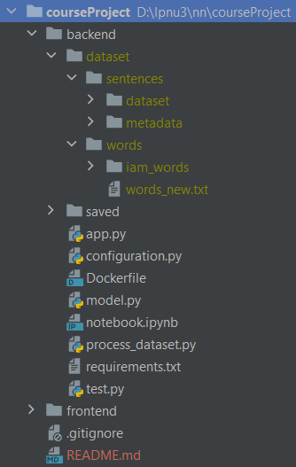
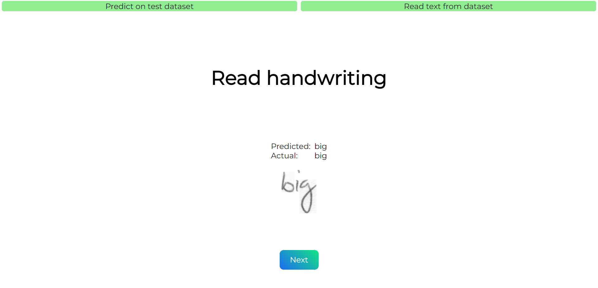
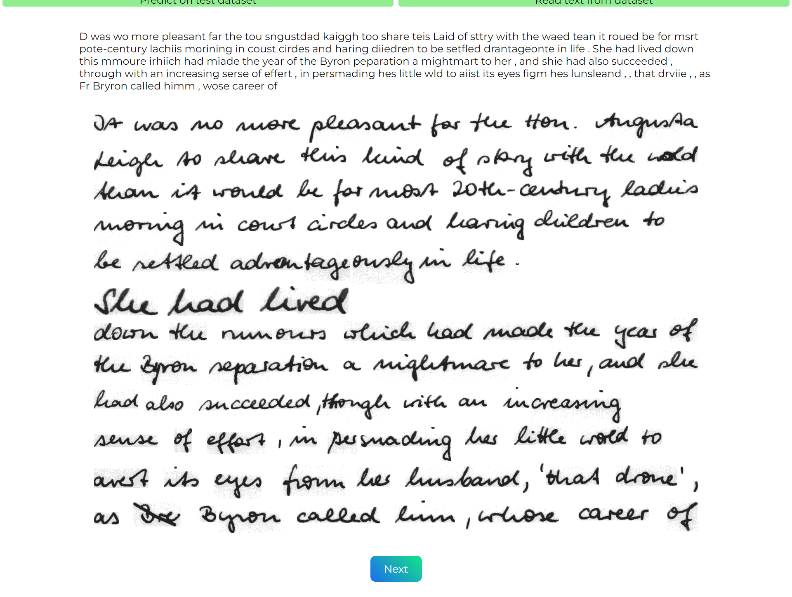

<h1 id="handwriting-recognition">Handwriting-Recognition</h1>

<h2>Requirements</h2>

<ol>
<li>Python v3.7.</li>
<li>Node.js v18.16.0.</li>
<li>npm package manager v8.6.0.</li>
<li>Angular CLI: v16.0.1.</li>
<li>OS: win32 x64</li>
</ol>

<h2>Steps to get started</h2>

<ol>
<li>Clone repository.    </li>
<li>Install datasets:    <ul>
<li><a href="https://www.kaggle.com/datasets/nibinv23/iam-handwriting-word-database">Dataset with words</a></li>
<li><a href="https://www.kaggle.com/datasets/debadityashome/iamsentences">Dataset with sentences and forms</a>    </li>
</ul>
</li>
<li>Place downloaded datasets in &#39;dataset&#39; directory. It should looks like:   </li>
<li>Run backend of app. In the root of cloned project open terminal and run following commands:  <code>cd backend</code>  <code>pip install -r requirements.txt</code>  <code>python app.py</code></li>
<li>Run frontend app. In the root of cloned project open terminal and run following commands:  
 <code>cd frontend</code>  <code>npm install</code>  <code>ng serve</code></li>
<li>Go to <a href="http://localhost:4200/">http://localhost:4200/</a> to open app.</li>
</ol>

<h2>Small demo</h2>

<ul>
<li>You can predict text by handwriting from test dataset on default tab. Next button shows next word.  
</li>
<li>You can also read full text on the second tab. Next button shows next document.  
</li>
</ul>

<h2>Model evaluation</h2>
Total count of words:  4456 Count of correctly predicted words:  3029 Percentage : 67.97576301615798% .  

Total count of symbols:  19048 Count of correctly predicted symbols:  15423 Percentage : 80.96913061738765% .  

